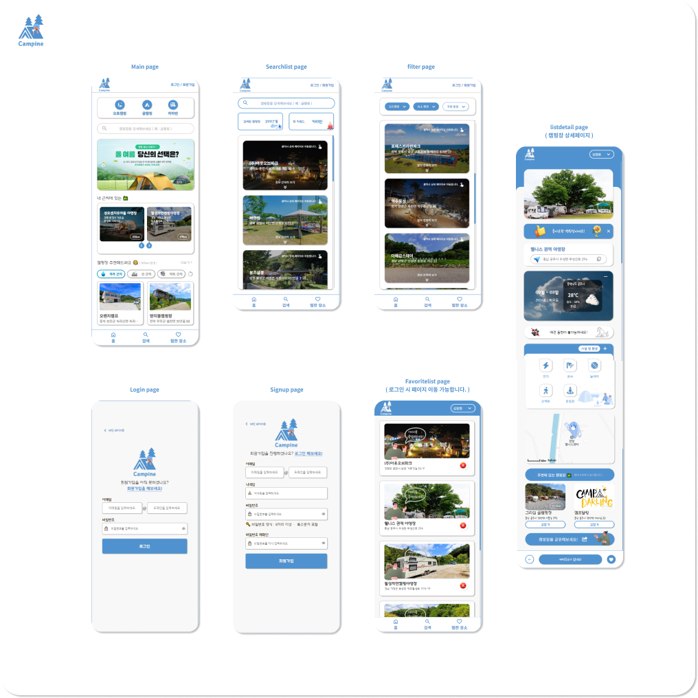

# Camfine

---

## 1. 프로젝트 개요
- **프로젝트 이름:** Camfine
- **목표:** 포트폴리오용 캠핑장 정보 조회 사이트
- **타겟 사용자:** 20 ~ 40대

---

## 2. 기능
- **핵심 기능:** 
ㆍ 회원가입 및 로그인 시스템 - Firebase Authentication을 활용하여 사용자의 안전한 회원가입과 로그인을 지원합니다. 사용자의 정보는 Firebase Firestore에 안전하게 저장되며, 실시간으로 동기화됩니다. 
ㆍ 캠핑장 정보 조회 및 필터 시스템 - 공공데이터포털 API를 활용하여 전국의 다양한 캠핑장 정보를 실시간으로 조회할 수 있습니다. 캠핑장 이름, 지역, 시설 종류 등을 포함한 상세한 정보를 검색할 수 있습니다, 사용자의 선호도에 따라 조건별로 필터링하여 결과를 맞춤형으로 제공합니다. 

- **추가 기능:** 
ㆍ 날씨 정보 조회 기능 - 각 캠핑장 지역의 실시간 날씨 정보를 Weather API를 통해 제공하여 사용자들이 캠핑을 계획할 때 날씨를 고려할 수 있도록 지원합니다. 현재 기온, 습도의 세부적인 날씨 데이터를 캠핑장별로 시각화하여 제공합니다. 
ㆍ 캠핑장 위치 정보 및 상세 조회 기능 - 카카오 맵 API를 통합하여 캠핑장의 정확한 위치 정보를 지도 상에 표시합니다. 사용자들은 손쉽게 주변 시설, 교통 정보 등을 확인할 수 있으며 길찾기를 통해 해당 캠핑장과 주변에 있는 캠핑장의 길찾기를 통해 캠핑장간의 거리 및 길찾기를 할 수 있습니다. 
ㆍ 캠핑장 즐겨찾기 기능 - '좋아요' 서비스로 마음에 드는 캠핑장을 손쉽게 저장하고, 나중에 다시 찾아볼 수 있도록 즐겨찾기 목록에 추가할 수 있습니다.

---

## 3. 프로토타입

- **프로토타입:** 위의 이미지를 통해 대략적인 프로토타입을 이해하실수 있습니다. 그 외 나머지 기능들 및 ui는 밑의 링크를 통해 확인가능합니다.

--- 

## 4. etc
- **플랫폼:** 모바일 웹, 앱
- **사용 기술:** react, js, scss, html
- **개발 인원:** front end 1명

---

## 5. 설명
- **설명:** 해당 프로젝트 Camfine은 포트폴리오용으로 캠핑장 정보 조회 사이트를 제작해봤습니다. 이 프로젝트는 전국의 다양한 캠핑장을 탐색하고 일일히 캠핑장을 찾아보기 힘든 사용자를 위해 개발되었습니다. Firebase 기반의 회원가입 및 로그인 시스템과 공공데이터포털 API를 활용하여 캠핑장 정보를 실시간으로 조회하며, 사용자에게 보다 편리한 캠핑장 검색, 필터, 위치 정보 조회 등의 기능을 제공합니다. 또한, 각 캠핑장 지역의 실시간 날씨 정보와 즐겨찾기 기능을 통해 사용자의 캠핑 계획을 보다 효율적으로 지원합니다. 더 자세한 내용은 https://changhyoun.github.io/Camfine 를 통해 확인가능합니다.
